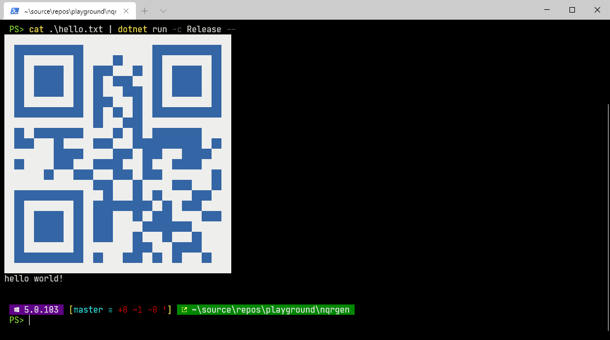

# nqrgen




## usage

```powershell
cat .\hello.txt | dotnet run -c Release --
cat .\hello.txt | dotnet run -c Release -- -r File -d TestResults -s 300
cat .\hello.txt | dotnet run -c Release -- -r File -d TestResults -s 300 -m 1 -c High
dotnet run -c Release -- -v Hellö -r Console -s 300 -m 1 -c High
dotnet run -c Release -- -v Hellö -m 1 -c Low
```